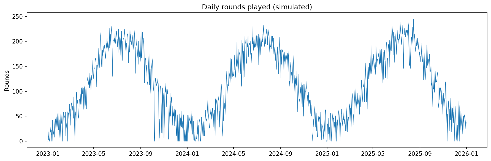
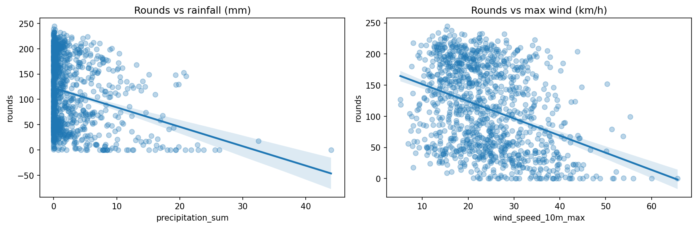

# Golf Weather-to-Revenue Model
 
Quantifying how weather drives daily demand at a Scottish links golf course, and
converting the results into commercial pricing recommendations.
 
> **Data transparency:** Weather data is real — daily observations for St Andrews
> from the [Open-Meteo historical archive](https://open-meteo.com/). Booking data
> is **simulated**, calibrated from my experience working in golf operations at
> St Andrews. All prices, capacities and revenue figures are illustrative. No
> operator data is published in this repository.
 
## Business problem
 
Demand for links golf is highly weather-sensitive, but the revenue cost of bad
weather is rarely quantified. A course that knows what a wet or windy day
actually costs can act on the forecast rather than react to the day: releasing
discounted standby tee times when demand is predicted to collapse, adjusting
staffing levels, and setting deposit policy on high-risk dates. This project
builds that quantification for a single course.
 
## Data
 
**Weather (real):** daily maximum temperature, precipitation, maximum wind speed
and sunshine hours for St Andrews (56.34, −2.79), 2023–2025, retrieved from the
free Open-Meteo archive API. The notebook downloads this automatically.
 
**Bookings (simulated):** daily rounds played and revenue, generated with
seasonality, a weekend uplift, day-to-day noise, and built-in weather
sensitivities. All generating assumptions are named constants in the notebook
(base daily rounds, rain penalty per mm, wind penalty above a threshold, and so
on), calibrated to be realistic for a links course using my operational
experience. Simulating the data keeps the repository fully public and
reproducible while the methodology remains identical to what would be run on
real tee-sheet data.
 
## Method
 
1. **Exploration.** Time-series, scatter and monthly views of rounds against
   each weather variable.
2. **Regression.** OLS of daily rounds on rainfall, wind speed, temperature,
   sunshine hours, a weekend indicator, and month fixed effects. A second
   specification tests whether wind matters only above a threshold (35 km/h)
   rather than linearly.
3. **Revenue translation.** The rain coefficient is converted into estimated
   rounds lost per year, revenue at risk, and the amount recoverable under a
   rain-triggered standby pricing policy, with a sensitivity table across
   recovery-rate and discount assumptions.
A key methodological point: raw correlations dramatically overstate weather
effects, because wet and windy days cluster in winter when demand is low for
seasonal reasons. The regression separates weather effects from seasonality —
without that control, the apparent wind effect is roughly double its true size.
 

 

 
## Key findings
 
*(Coefficients below are from the simulated dataset; see the notebook for full
regression output.)*
 
- **Rainfall reduces rounds by ~3.4 per mm** — the largest and most robust
  weather effect. A 10&nbsp;mm day costs roughly a fifth of typical volume.
- **Wind shows a threshold effect**: little impact in normal conditions, with
  demand falling once maximum wind exceeds ~35 km/h.
- **Sunshine and temperature both lift demand** independently of season.
- **Weekends add ~15 rounds per day** over comparable weekdays.
- The model explains the large majority of daily variance in the simulated
  data (R² in the notebook output); on real data, a figure near 60% is a more
  realistic expectation.
## Commercial recommendations
 
- **Rain-forecast-triggered standby pricing.** When the 24–48h forecast predicts
  materially suppressed demand, release last-minute discounted tee times to
  recover otherwise-lost rounds. Under illustrative assumptions (25% of lost
  rounds recovered at 60% of full price), the notebook estimates the annual
  recovery; the sensitivity table shows the range across assumptions rather
  than a single point estimate.
- **Forecast-based staffing.** Predicted low-demand days can run reduced
  starter and ranger cover.
- **Weather-conditional deposit policy** (future work): if no-show rates rise
  with forecast rain, deposits on high-risk dates protect booked revenue. This
  requires no-show data and is planned as a follow-up analysis.
## Limitations
 
- Booking data is simulated, so coefficient magnitudes reflect calibrated
  assumptions rather than measured behaviour. The methodology transfers
  directly to real tee-sheet data.
- Single-course model: no substitution effects between neighbouring courses.
- Weather effects are estimated conditional on the course being open; days when
  extreme weather closes a course entirely are a separate (and additional)
  revenue cost.
- Temperature, sunshine and season are correlated, so individual coefficients
  for those variables should be interpreted cautiously; the rain effect is
  robust to this.
## How to run
 
```bash
pip install -r requirements.txt
jupyter lab notebooks/analysis.ipynb
```
 
Run the notebook top to bottom. Weather data downloads automatically from
Open-Meteo (no API key required); the bookings dataset is generated by the
notebook. Figures are written to `figures/`.
 
## Roadmap
 
- Out-of-sample validation and residual diagnostics
- 7-day demand forecast using the Open-Meteo forecast API
- No-show analysis and deposit-policy evaluation
- Backtest of the standby pricing rule across trigger thresholds